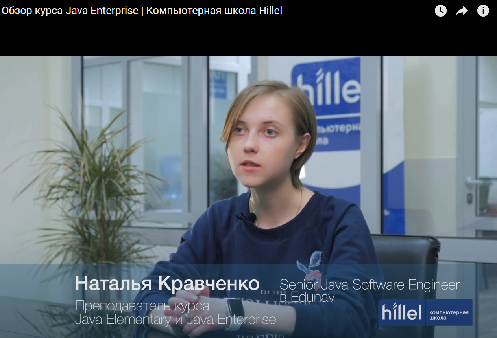

# MVC

[YouTube канал Hillel IT School](https://www.youtube.com/channel/UCIyfaiKil5oomY64XIRJEAA)

[Разработка MVC приложения на Java за два часа | Компьютерная школа Hillel](https://www.youtube.com/watch?v=Z9dvZyEofAg&t=1s)

[Ученик 0](https://github.com/tronov/usersystem)

[Ученик 1](https://github.com/rubfan/strategy-card-game)

## Запросы к приложению

http://localhost:9999/user-system/

http://localhost:9999/user-system/users

http://localhost:9999/user-system/users/validation